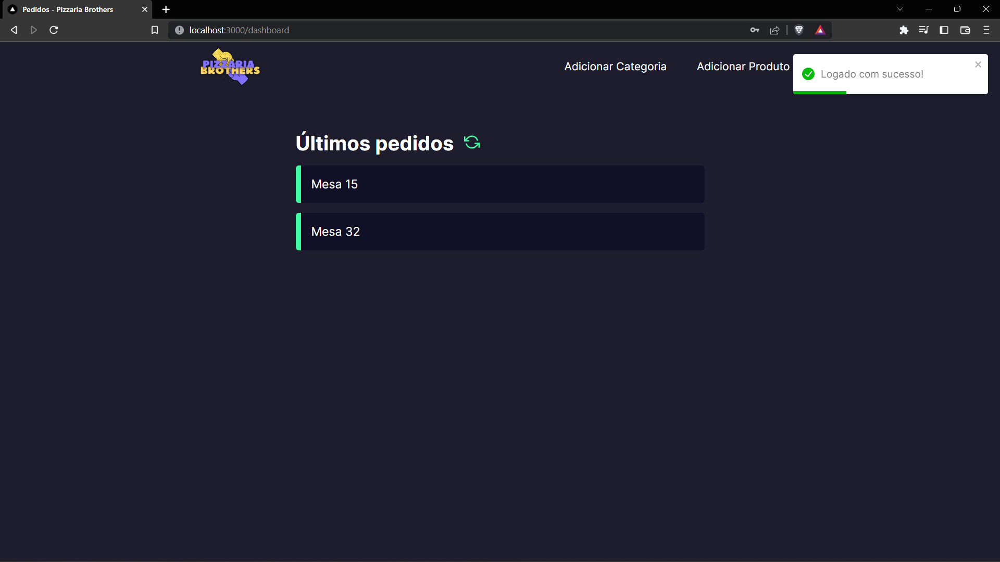

# <div align="center">🍕A RESTAURANT WEBSITE</div>


    


## <a href="https://react-pizza-gules.vercel.app/" target="_blank">LIVE DEMO</a>


<p align="center">This is a web system for restaurants that performs a CRUD.</p>

<p align="center">🏼click <a href="https://github.com/matheudsp/reactPizza-backend.git" target="_blank">here</a> to see the backend of the application.🏼</p>

                  

## 🛠️ Technologies

<ul>
  <li><a href="https://reactjs.org/">React</a></li>
  <li><a href="https://nextjs.org/">Next.js</a></li>
  <li><a href="https://www.pgadmin.org/">PostgreSQL</a></li>
  
</ul>

## 🧾 Dependencies

```
"dependencies": {
    "axios": "^1.1.2",
    "jwt-decode": "^3.1.2",
    "next": "12.3.0",
    "nookies": "^2.5.2",
    "react": "18.2.0",
    "react-dom": "18.2.0",
    "react-icons": "^4.4.0",
    "react-modal": "^3.16.1",
    "react-toastify": "^9.0.8",
    "sass": "^1.54.9"
  }
```
## ⚙️ Requirements

<ul>
  <li><a href="https://git-scm.com/">Git</a></li>
  <li><a href="https://nodejs.org/en/">Node.js</a></li>
  <li><a href="https://www.npmjs.com/">NPM</a> or <a href="https://yarnpkg.com/">Yarn</a></li>
</ul>

## 🚀 Installation

```
$ git clone https://github.com/matheudsp/reactPizza.git

$ npm install
$ npm start
```

```
in PgAdmin
$ CREATE DATABASE pizzaria

in CMD
$ npm install prisma --save-dev
$ npx prisma migrate dev 

```
<a href="https://github.com/matheudsp/reactPizza-backend" >Backend</a>  needed 
<p>You will need to create a database through PostgreSQL and set the DATABASE_URL in the .env file to point to your existing database.</p>
<p>You will also need to install Prism to perform database schema migration </p>
<p>The application will open in the browser on <a href="http://localhost:3000">http://localhost:3000</a> </p>

    
    
    
    
    
    
